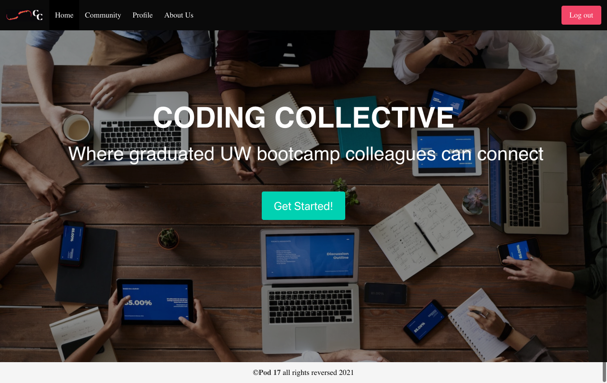
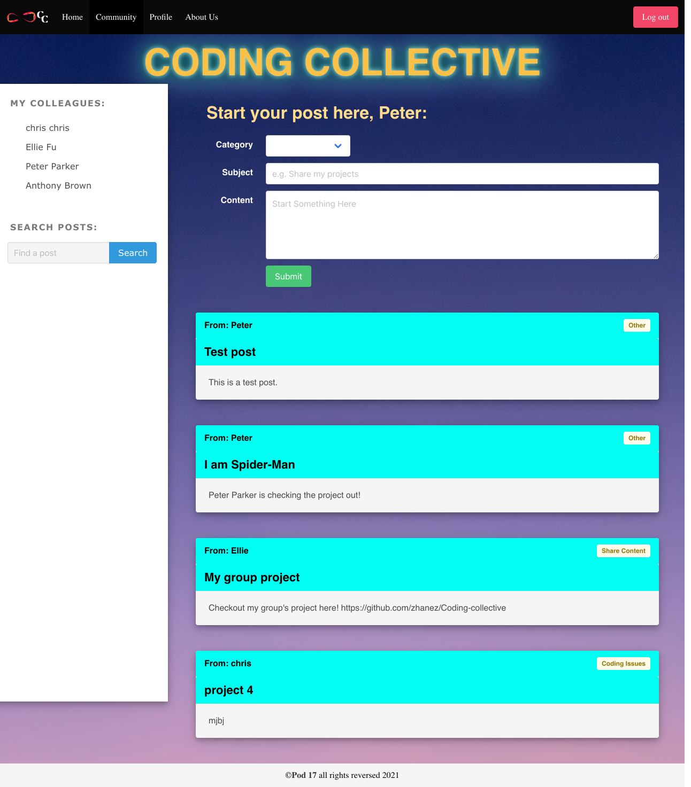
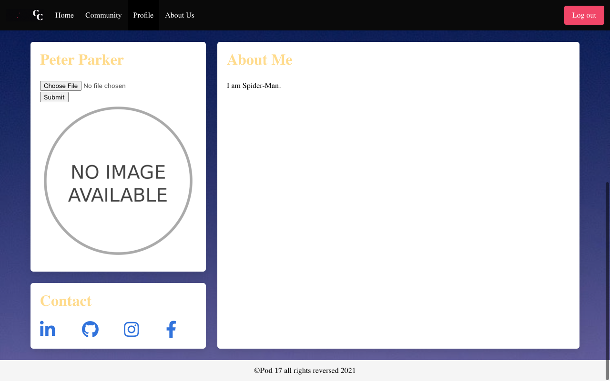

# Coding-collective
## Table of Contents
- [Coding-collective](#coding-collective)
  - [Table of Contents](#table-of-contents)
  - [Description](#description)
  - [Functionality-and-Appearance](#Functionality-and-Appearance)
  - [Project-Location](#project-location)
  - [Dependencies](#dependencies)
  - [Usage](#usage)
  - [Future-Direction](#future-direction)
  - [Credits](#credits)
  - [Resources](#resources)
  - [License](#license)

## Description
Coding Collective is a web and mobile responsive application that provides a central hub where coding bootcamp students can connect and collaborate with one another, even after graduation. When we heard that there will be a Slack channel for our cohort after graduation, we realized that we could build something better and more meaningful. Although Slack is helpful as a messaging tool,  it is not designed to help us keep in touch, share resources and provide feedback, since messages disappear pretty quickly.

Recognizing that learning doesn’t stop after graduation, we created the Coding Collective so that we can continue to grow and improve as developers together!

This application was created with the following User Story and Acceptance Criteria in mind:
```
AS a coding bootcamp student
I WANT a central location to connect with other bootcamp students
SO THAT we can network, share projects, and receive feedback
```
```
GIVEN that I want a central location to connect with my bootcamp coding students
WHEN I create an account
THEN my account is saved in the database and I securely log into my community page
WHEN I am brought to my community page
THEN I see a newsfeed of posts shared by my bootcamp classmates and an area to create a new post
WHEN I create a new post
THEN it is saved in MongoDB and it is displayed on the community newsfeed
WHEN I click on my profile
THEN I see my profile picture, about me section, and the github, linkedin, facebook, instagram icons are all linked to my own URLs
WHEN I click on my classmate's name
THEN I see their unique profile
WHEN I am not logged in
THEN I see the "Sign Up" and "Log In" buttons on the Navbar, and I am re-routed to the Sign Up page when I try clicking on the Community or Profile pages 
WHEN I am logged in
THEN I see the "Log Out" button on the Navbar and I can view the Community and Profile pages
```

## Functionality-and-Appearance
Homepage:


Community page for posts:


User profile page:


## Project-Location
* [Repository](https://github.com/zhanez/Coding-collective)
* [Deployed](https://coding-collective.herokuapp.com)
  
## Dependencies
The dependencies are:
<br>

For the server and views:
* [express](http://expressjs.com/)
<br>

For the user database:
* [mongoDB]()
* [axios](https://www.npmjs.com/package/axios) 
<br>

For the authorization and login ability:
* [passport](https://www.npmjs.com/package/passport)
* [passport-local](https://www.npmjs.com/package/passport-local)
* [bcryptjs](https://www.npmjs.com/package/bcryptjs)
* [express-session](https://www.npmjs.com/package/express-session)

There is a `package.json` included, the following commands should be run to install dependencies:

```bash
npm i
```

## Usage
Use the links below to use the application live. If you prefer to run the application from your computer, you can use the following command after installing the dependencies:
```bash
node server.js
```

The application displays a login page with a form to enter the user's credentials (email and password). The user can go to the signup form if they do not have an account. Upon logging in or signing up, the user is brought to the application homepage.

See Screenshots:

## Future-Direction
Some future add-ons that would enhance our application include:
- Messaging Function between users 
- Filter categories for posts (e.g., "coding issues", "share content")
- Expand beyond our cohort, so that users can search resources in other cohorts (e.g., 2020 Fall Full-time cohort, 2020-2021 Part-Time cohort)
- Comment section, like/dislike buttons for posts 
- Add edit section for profile

## Credits
- Zhane Zabala (https://github.com/zhanez/)
- Marco Oseguera (https://github.com/Bejarano03)
- Yuwen Yu (https://github.com/ywen26)
- Chetan Sekhon (https://github.com/Chetansekhon)
- Ellie Fu-Hinthorn (https://github.com/elliefh)
  
## Resources
- [Bulma] (https://bulma.io)
- [Multer]
- [Authentication]

## License
Copyright (c) [2021] [Zhane Zabala, Marco Oseguera, Yuwen Yu, Chetan Sekhon, Ellie Fu-Hinthorn]

Permission is hereby granted, free of charge, to any person obtaining a copy of this software and associated documentation files (the "Software"), to deal in the Software without restriction, including without limitation the rights to use, copy, modify, merge, publish, distribute, sublicense, and/or sell copies of the Software, and to permit persons to whom the Software is furnished to do so, subject to the following conditions:

The above copyright notice and this permission notice shall be included in all copies or substantial portions of the Software.

THE SOFTWARE IS PROVIDED "AS IS", WITHOUT WARRANTY OF ANY KIND, EXPRESS OR IMPLIED, INCLUDING BUT NOT LIMITED TO THE WARRANTIES OF MERCHANTABILITY, FITNESS FOR A PARTICULAR PURPOSE AND NONINFRINGEMENT. IN NO EVENT SHALL THE AUTHORS OR COPYRIGHT HOLDERS BE LIABLE FOR ANY CLAIM, DAMAGES OR OTHER LIABILITY, WHETHER IN AN ACTION OF CONTRACT, TORT OR OTHERWISE, ARISING FROM, OUT OF OR IN CONNECTION WITH THE SOFTWARE OR THE USE OR OTHER DEALINGS IN THE SOFTWARE.
